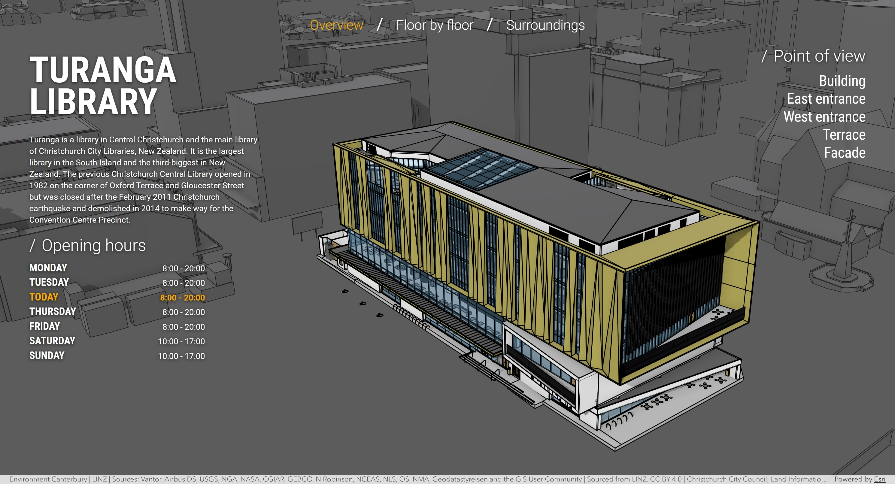

# Building Viewer

Building Viewer is a Vite and TypeScript application that presents [Tūranga](https://my.christchurchcitylibraries.com/turanga/), the central library in Christchurch, New Zealand, as an interactive 3D scene. It uses the current component-based programming pattern from the [ArcGIS Maps SDK for JavaScript](https://developers.arcgis.com/javascript/latest/) and loads its content from an ArcGIS WebScene.

[View it live](https://esri.github.io/building-viewer)

## Features

- Explore Tūranga Library in an interactive 3D scene from a set of predefined viewpoints.
- Discover each public floor, including its facilities, images, description, and Māori name pronunciation.
- Examine nearby parking, transportation, and points of interest.
- Adapt the application to another building through an ArcGIS WebScene and a TypeScript configuration file.

## Instructions

1. Fork and then clone the repo.
2. Install dependencies with `npm install`.
3. Update the config file with your services/data.
4. Start the development app with `npm run dev`.
5. The production app can be created with `npm run build`.

The application is organized into three sections whose content comes from the WebScene and `src/config.ts`:

- **Overview** displays the WebScene title, the configured description and opening hours, and selectable viewpoints created from WebScene slides.
- **Floor by floor** uses the configured `FLOORS` collection to display floor names, descriptions, pronunciation recordings, and mappings between UI floors and Building Scene Layer `BldgLevel` values. Floor facilities and pictures are filtered by their numeric `level_id` attribute.
- **Surroundings** controls the configured parking and transportation layers and creates links to nearby places from specially named WebScene slides.

To use another building, create a WebScene with the layers and slides needed by the sections you want to retain, then update the identifiers and content in `src/config.ts`. The current application uses exact layer titles because each title identifies a specific role:

| Layer title                    | Role and required data                                                                                                  |
| ------------------------------ | ----------------------------------------------------------------------------------------------------------------------- |
| `Building: Turanga Library`    | Building Scene Layer displayed by the application and filtered by floor.                                                |
| `City Model: Christchurch`     | Scene Layer used as the surrounding 3D city model.                                                                      |
| `Floor points`                 | Feature Layer containing floor facilities. Features must have a numeric `level_id` field for filtering.                 |
| `Floor pictures`               | Feature Layer containing image markers. Features must have a numeric `level_id` field and `url` and `title` attributes. |
| `Surroundings: Car Parks`      | Feature Layer controlled by the Car Parks switch.                                                                       |
| `Surroundings: Transportation` | Group Layer controlled by the Transportation switch.                                                                    |

WebScene slide names also determine their role:

- `Overview`, `Floor by floor`, and `Surroundings` define the initial camera for the corresponding section.
- Slides beginning with `Points of Interest: ` appear as destinations in the Surroundings section. The text after the prefix becomes the displayed label.
- All other slides appear as selectable viewpoints in the Overview section.

## Resources

The following libraries, APIs, and datasets were used to make this application:

- [ArcGIS Maps SDK for JavaScript](https://developers.arcgis.com/javascript/latest/) for the map.
- Turangua's BIM data provided by [Christchurch City Council](https://www.ccc.govt.nz/)
- [Christchurch city model](https://www.linz.govt.nz/news/2014-03/3d-models-released-christchurch-city) provided by [Christchurch City Council](https://www.ccc.govt.nz/)

- Floor names pronunciation recordings are from [Christchurch City Libraries](https://my.christchurchcitylibraries.com/turanga/) ([He Hononga](https://my.christchurchcitylibraries.com/wp-content/uploads/sites/5/2019/01/He-Hononga.mp3), [Hapori](https://my.christchurchcitylibraries.com/wp-content/uploads/sites/5/2019/01/Hapori.mp3), [Tuakiri](https://my.christchurchcitylibraries.com/wp-content/uploads/sites/5/2019/01/Tuakiri.mp3), [Tūhuratanga](https://my.christchurchcitylibraries.com/wp-content/uploads/sites/5/2019/01/T%C5%ABhuratanga.mp3), and [Auahatanga](https://my.christchurchcitylibraries.com/wp-content/uploads/sites/5/2019/01/Auahatanga.mp3)).
- [Roboto font](https://fonts.google.com/specimen/Roboto)

## Disclaimer

This demo application is for illustrative purposes only and it is not maintained. There is no support available for deployment or development of the application.

## Contributing

Esri welcomes contributions from anyone and everyone. Please see our [guidelines for contributing](https://github.com/esri/contributing).

## Licensing

Copyright 2026 Esri

Licensed under the Apache License, Version 2.0 (the "License"); you may not use this file except in compliance with the License. You may obtain a copy of the License at

[http://www.apache.org/licenses/LICENSE-2.0](http://www.apache.org/licenses/LICENSE-2.0)

Unless required by applicable law or agreed to in writing, software distributed under the License is distributed on an "AS IS" BASIS, WITHOUT WARRANTIES OR CONDITIONS OF ANY KIND, either express or implied. See the License for the specific language governing permissions and limitations under the License.

A copy of the license is available in the repository's [license.txt](../license.txt) file.
