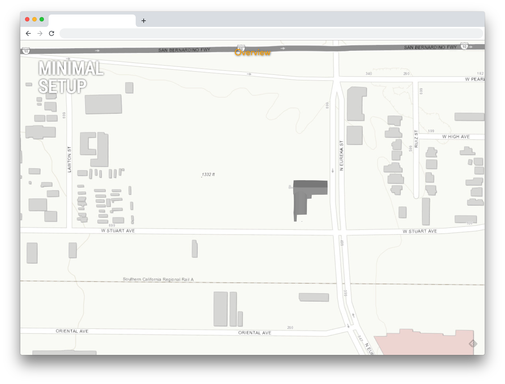
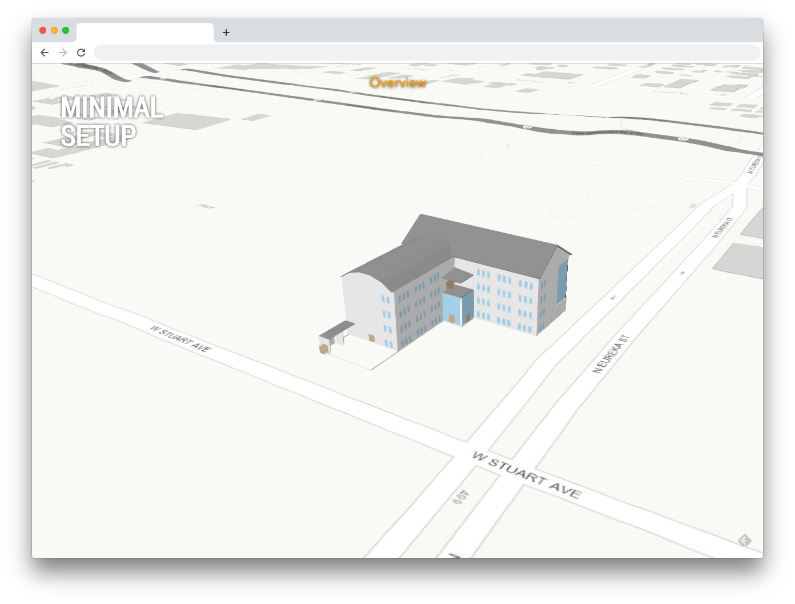
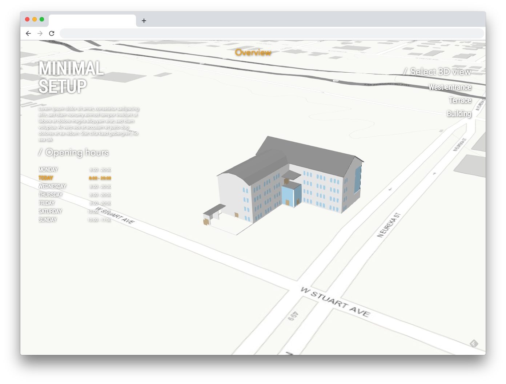

# Minimal setup

### Prepare a minimal webscene:
1. Create a new webscene
1. Add a Building Scene layer and add the suffix `Main BSL:` in front of it's name
1. Save the webscene, give it a nice title and copy the webscene id. You will need it in a few next steps

### Get your own copy of the demo app

1. Clone the git repository in your local machine and then go into the folder:
```
git clone https://devtopia.esri.com/yann9059/BSL-Demo-App
cd BSL-Demo-App
```
1. Remove the `.git` repository reference `rm -rf .git`
1. Install dependency: `npm run install`
1. Compile the code: `npm run build`
1. Start the server: `npm run server`
1. You should see now the app running in your browser at `http://localhost:8888/`: 


### Edit the content with your own webscene
1. Open `src/config.tsx` in your favorite code editor
2. Delete all the content except the two first obscur lines
3. Now you need to define 2 parameters in the config to get started:

    1. The `websceneId` of the webscene you created above

    ```
    export const websceneId = "YOUR WEBSCENE ID HERE";
    ```

    *Note that you may to also export on which portal this webscene resides if different from the ArcGis's portal: `export const portalUrl = "https://your-portal-url.com";`*

    2. The `sections` you'd like to have in your app (see documentation about sections). Let's start with only one section, the home page:


    ```typescript
    // first import the section:
    import HomeSection = require("./sections/HomeSection");

    // then export the `sections` parameter:
    export const sections = [
        new HomeSection({})
    ];
    ```

4. Recompile the code (note that the app ships with a little util that watch files and recompile for you. Just run `npm run dev` in a differnet terminal window)
5. You should see your building in the app now if you reload your webviewer:




### Let's add content

The title of the home page is the title of your scene. If you would like to change it, you can simply update the title of the scene.

1. First, the view of the building when opening the app isn't really appealilng. Let's change this.
    1. Go back to your webscene
    2. Navigate to a view that please you
    3. Save a slide with name "Overview"
    4. Save your webscene and reload the demo app. You should have a better view when you enter the app:



2. Let's add some description on the left side:
    1. Go back to your webscene and go to "Properties"
    2. Add your text in the webscene description
    3. Save the webscene and reload the demo app. You should now see your text on the left side:

 

 3. Let's add different point of views for the user to appreciate the building in all corners:
    1. Go back to your webscene and go to "Slides"
    2. Move your view to the location you would like
    3. Create a new slide
    4. Repeat as much as you want, and then save your scene
    5. Reload the demo app, you should see now some points of view:


 3. Let's add the opening hours:
    1. Go now to the file `src/config.tsx`
    2. Import the necessary classes:

```
import {Timetable, DayTimetable} from "./widgets/Timetable/Timetable";
import Collection = require("esri/core/Collection");
```

    2. Add the timetable to the home section, and add all your opening hours for every day:

```typescript
new HomeSection({
     timetable: new Timetable({
         dates: new Collection([
           new DayTimetable({
             opens: "8:00",
             closes: "20:00"
           }),
           new DayTimetable({
             opens: "8:00",
             closes: "20:00"
           }),
           new DayTimetable({
             opens: "8:00",
             closes: "20:00"
           }),
           new DayTimetable({
             opens: "8:00",
             closes: "20:00"
           }),
           new DayTimetable({
             opens: "8:00",
             closes: "20:00"
           }),
           new DayTimetable({
             opens: "10:00",
             closes: "17:00"
           }),
           new DayTimetable({
             opens: "10:00",
             closes: "17:00"
           })
         ])
      })
   })
```
    3. Save your file, recompile the typsecrip and reload the app
    4. You should now see the time table on the bottom left of the home page:



