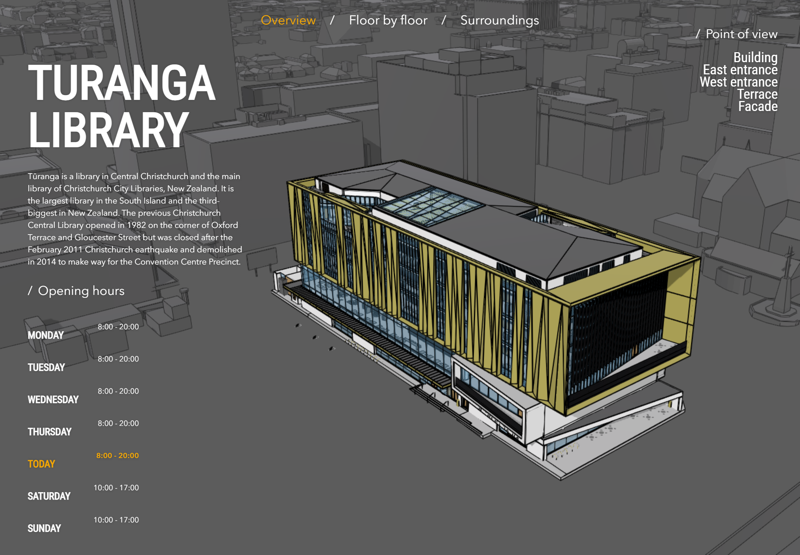
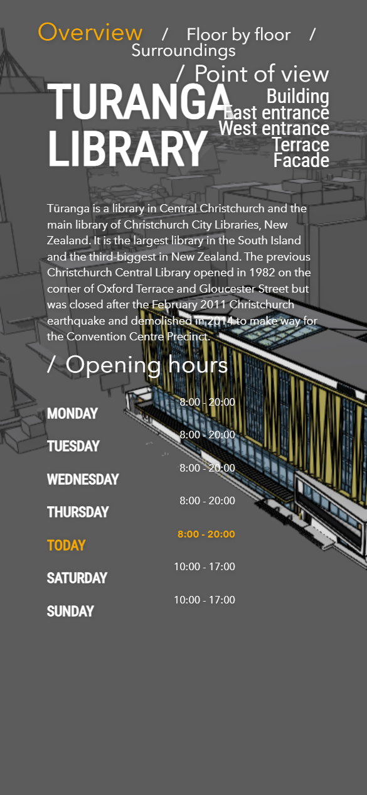
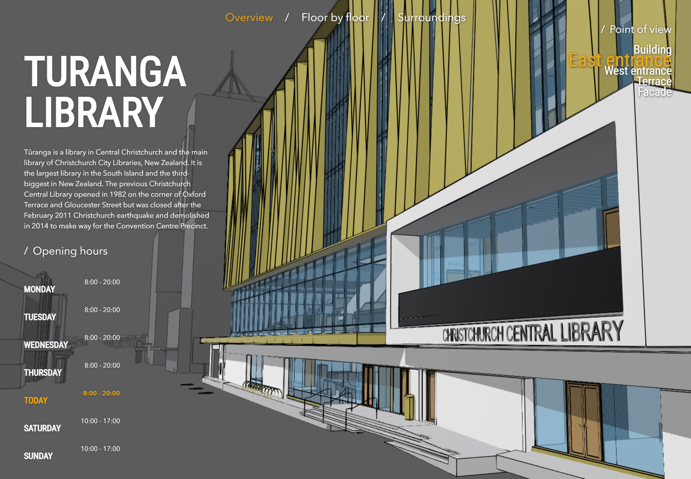
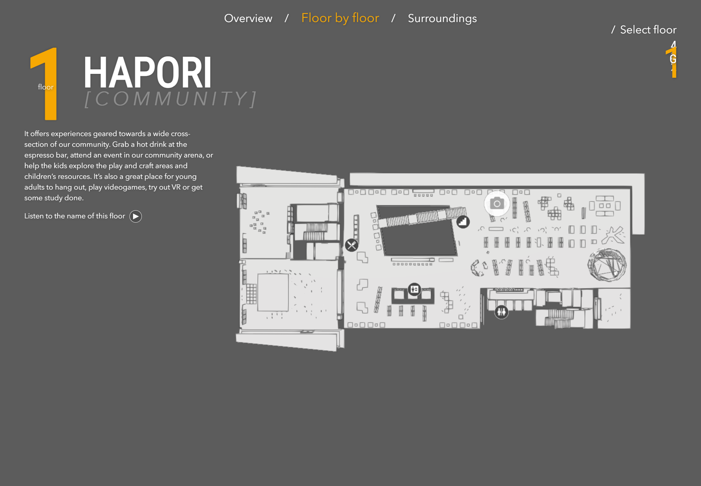
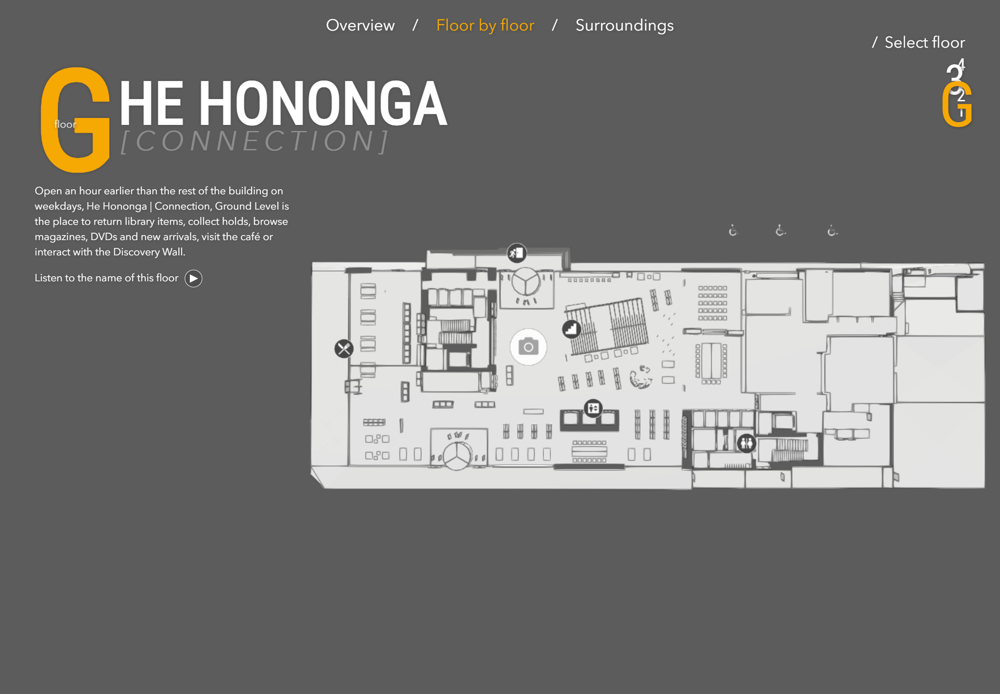
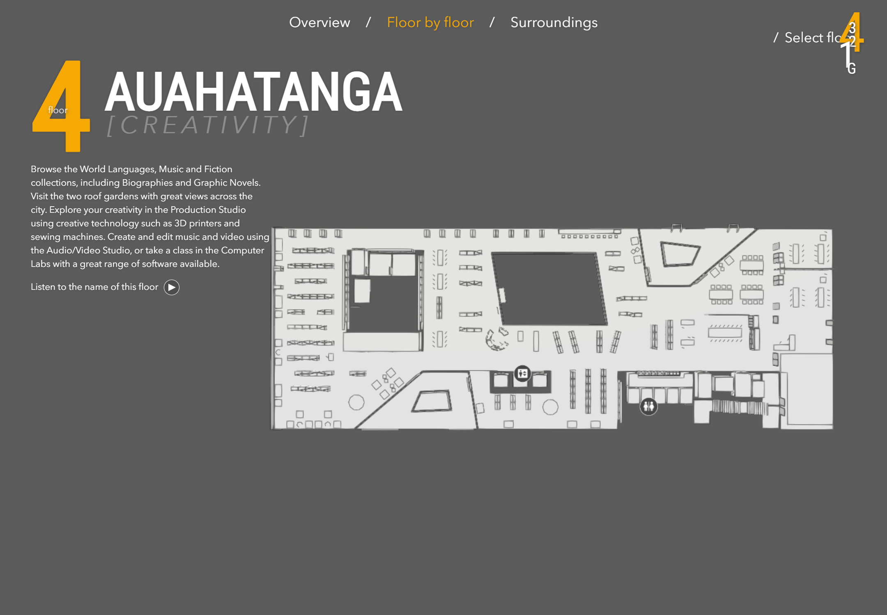
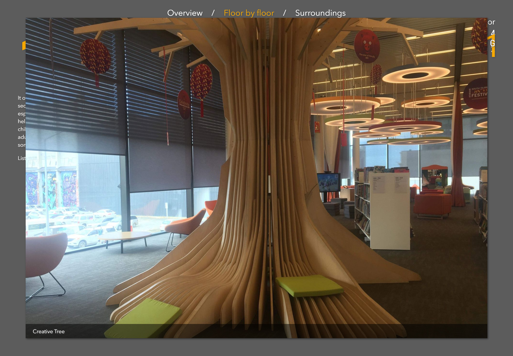
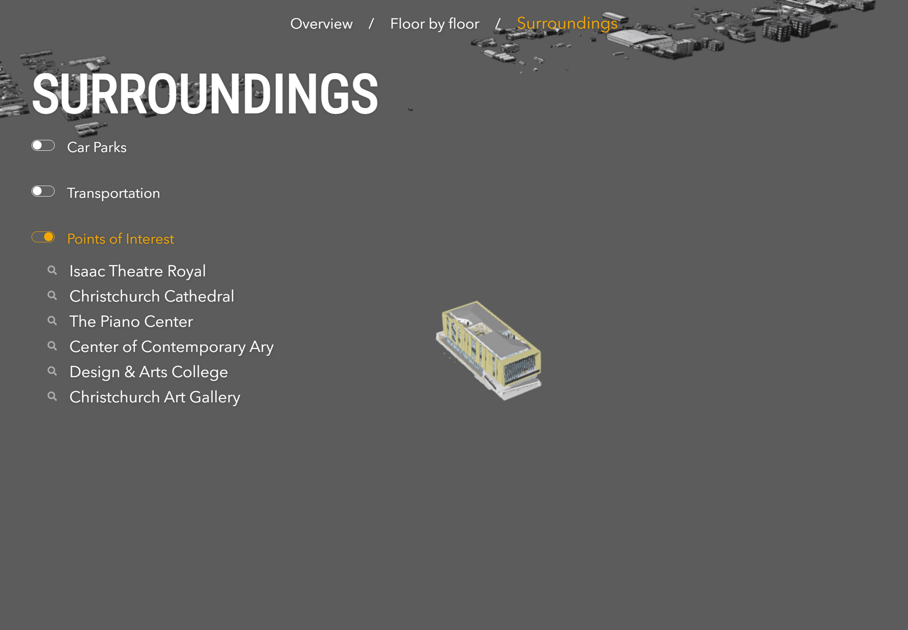
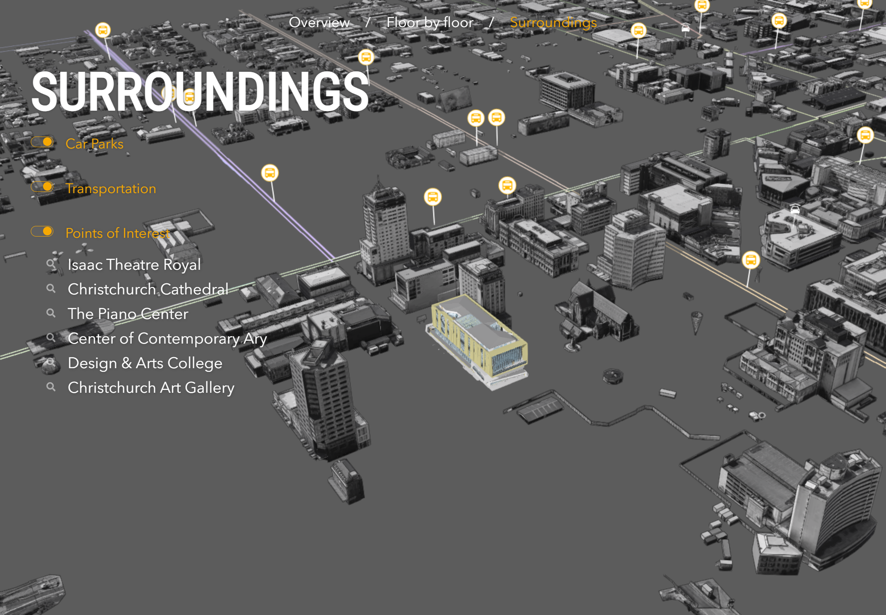
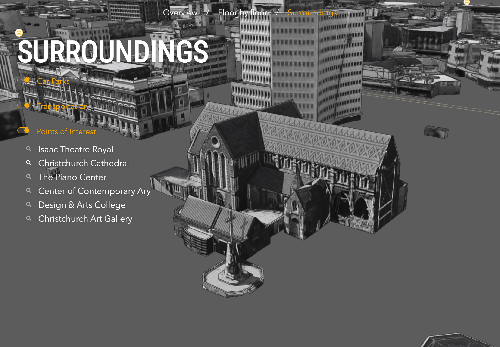

# Building Viewer Rebuild Product Requirements Document

This document specifies the observable product behavior of the Building Viewer as of August 7, 2026. It is based only on repository inspection, the configured ArcGIS WebScene and services, and Playwright testing of the application at `http://localhost:8888/`.

Status labels used throughout:

- **Verified**: confirmed in source and/or in the running application.
- **Specified correction**: current behavior is broken; the product owner directed the rebuild to use the corrected behavior.
- **Assumption**: inferred from available evidence and must be confirmed.
- **Unknown**: could not be established from source or runtime testing.

## Non-Conclusive Findings

1. **Audio playback is not conclusively verified.** **Verified:** all five floor audio controls change between play and pause visual states. The first runtime audio interaction produced a browser page error with no message, and the MP3 content could not be inspected by the available fetch tool. **Specified correction:** every configured pronunciation must play, pause, stop at the end, reset to the beginning after completion, and reset when its floor is selected again.
2. **The floor image popup is broken in the current application.** **Verified:** the live `Floor pictures` service returns a hit-testable point, but clicking it does not open an overlay. The code creates the popup in `#popup`, while no such container exists in `index.html`. **Specified correction:** clicking a floor picture marker must open the image overlay described in this document. Screenshot 06 was produced by mounting the existing popup widget under its expected parent and supplying the live `Creative Tree` feature; it illustrates the coded intended state, not a working current flow.
3. **The floor legend is not visible in the current application.** **Verified:** the code configures a legend from `Floor points`, but no rendered `#floorLegend` container exists. **Specified correction:** the legend must be visible in Floor by floor when the `Floor points` layer is available and hidden outside that section.
4. **The desktop floor selector overlaps.** **Verified:** at a 1440 x 1000 CSS-pixel viewport, floor labels overlap around the active floor. **Specified correction:** all floor labels must remain individually readable and selectable without overlap.
5. **The mobile layout overlaps.** **Verified:** at 390 x 844 CSS pixels, section navigation, Point of view controls, and the Overview title overlap. **Specified correction:** all controls and content must remain readable, non-overlapping, and operable at this viewport.
6. **Surroundings toggle links emit page errors.** **Verified:** the toggles still change state, but their `javascript:return;` targets emit browser errors. **Specified correction:** toggle interactions must complete without console or page errors.
7. **One point-of-interest name is misspelled in the WebScene.** **Verified:** the source label is `Center of Contemporary Ary`. **Specified correction:** display `Center of Contemporary Art` while retaining that source slide's viewpoint.
8. **The external Calcite Web stylesheet is blocked by the test browser.** **Verified:** the request to the configured S3 URL failed with `net::ERR_BLOCKED_BY_ORB`; no specific visual loss was isolated because the application's own styles rendered. **Unknown:** whether other deployment browsers accept the response.
9. **External picture behavior is dormant.** **Verified:** the `External pictures` service exists and code supports image popups, but `showExternalPoints` is false in the active configuration, so no external markers or external image flow are exposed. **Assumption:** the rebuild must preserve this disabled state unless separately specified.
10. **Exact floor legend rows are data-dependent.** **Verified:** configured categories are Elevators, Toilets, Stairs, Food & Drinks, and Exit. **Unknown:** which categories are guaranteed to have a feature on every floor.
11. **No loading, empty, offline, service-error, or unsupported-browser UI was found.** **Verified:** none is implemented in the current source. **Unknown:** required user-facing copy or behavior for these conditions.
12. **Accessibility behavior is not defined by the current product.** **Verified:** several controls are list items or links with JavaScript URLs, the audio button has no text alternative, and the map is exposed as a generic application. **Unknown:** required keyboard order, accessible names, announcements, and contrast targets beyond reproducing visible behavior.

## Data & Configuration Inventory

### Primary Portal Item

| Property               | Current value                                                                                             | Status                    |
| ---------------------- | --------------------------------------------------------------------------------------------------------- | ------------------------- |
| Portal                 | `https://zurich.maps.arcgis.com`                                                                          | Verified                  |
| WebScene ID            | `543648a92446497db8a92c06ce1ad0b1`                                                                        | Verified                  |
| WebScene REST metadata | `https://zurich.maps.arcgis.com/sharing/rest/content/items/543648a92446497db8a92c06ce1ad0b1?f=pjson`      | Verified                  |
| WebScene REST data     | `https://zurich.maps.arcgis.com/sharing/rest/content/items/543648a92446497db8a92c06ce1ad0b1/data?f=pjson` | Verified                  |
| Title                  | `Turanga Library`                                                                                         | Verified live portal item |
| Snippet                | `BIM data of the Turanga Library in Christchurch (NZ) as BuildingSceneLayer`                              | Verified live portal item |
| Owner                  | `scene_viewer`                                                                                            | Verified live portal item |
| Organization ID        | `cFEFS0EWrhfDeVw9`                                                                                        | Verified live portal item |
| Access                 | Public                                                                                                    | Verified live portal item |
| Spatial reference      | Web Mercator, WKID `102100`, latest WKID `3857`                                                           | Verified                  |
| Viewing mode           | Global                                                                                                    | Verified                  |
| Background             | RGB `[92, 92, 92]`                                                                                        | Verified WebScene data    |
| Atmosphere / stars     | Disabled / disabled                                                                                       | Verified runtime          |
| Weather                | Sunny, cloud cover `0.5`                                                                                  | Verified WebScene data    |
| Scene title source     | WebScene portal item title                                                                                | Verified                  |

The WebScene metadata credits LINZ Data Service, Christchurch City Council, Emma Browne-Cole, and Esri-sourced external/internal POI data. It links to `https://data.linz.govt.nz/`, `https://creativecommons.org/licenses/by/4.0/`, `https://www.ccc.govt.nz`, and source item `https://eaglelabs.maps.arcgis.com/home/item.html?id=e5f2593e8a4a41989c3d2b3968716d44`.

### Basemap, Elevation, and Operational Data

| Display title                | Type                   | Item ID                            | Service URL                                                                                                             | Initial WebScene visibility                                    |
| ---------------------------- | ---------------------- | ---------------------------------- | ----------------------------------------------------------------------------------------------------------------------- | -------------------------------------------------------------- |
| World Imagery                | Tiled map              | None                               | `https://services.arcgisonline.com/ArcGIS/rest/services/World_Imagery/MapServer`                                        | Visible                                                        |
| Terrain3D                    | Elevation              | None                               | `https://elevation3d.arcgis.com/arcgis/rest/services/WorldElevation3D/Terrain3D/ImageServer`                            | Visible                                                        |
| Christchurch Elevation       | Elevation              | `a66beb11c2c949d6869f651a180c822a` | `https://tiles.arcgis.com/tiles/cFEFS0EWrhfDeVw9/arcgis/rest/services/Christchurch_Elevation/ImageServer`               | Visible                                                        |
| City Model: Christchurch     | Scene                  | `d2394f6eaed848c7983831d33d683728` | `https://services2.arcgis.com/cFEFS0EWrhfDeVw9/arcgis/rest/services/City_Model_Christchurch/SceneServer`                | Visible                                                        |
| Surroundings: Car Parks      | Feature layer, layer 2 | `3ccd80899df54289948aeab2452ae55e` | `https://services2.arcgis.com/cFEFS0EWrhfDeVw9/ArcGIS/rest/services/Car_Parks/FeatureServer/2`                          | Visible in WebScene; disabled when Surroundings UI initializes |
| Surroundings: Transportation | Group                  | None                               | Contains Bus Routes and Bus Stops                                                                                       | Hidden                                                         |
| Bus Routes                   | Feature layer, layer 0 | `6648d344b7d2462393e7a1634289feb1` | `https://services2.arcgis.com/cFEFS0EWrhfDeVw9/ArcGIS/rest/services/Bus_Routes_Turanga/FeatureServer/0`                 | Visible within hidden group                                    |
| Bus Stops                    | Feature layer, layer 3 | `6fa691178a104748a3995d9d72353afd` | `https://services2.arcgis.com/cFEFS0EWrhfDeVw9/ArcGIS/rest/services/Bus_Stops_Christchurch/FeatureServer/3`             | Visible within hidden group                                    |
| Education - Culture          | Group                  | None                               | Contains Schools and Libraries; no application toggle                                                                   | Hidden                                                         |
| Schools                      | Feature layer, layer 1 | `fabc6363151c49979951d1b54c276f96` | `https://services.arcgis.com/cFEFS0EWrhfDeVw9/ArcGIS/rest/services/Schools/FeatureServer/1`                             | Visible within hidden group                                    |
| Libraries                    | Feature layer, layer 0 | `6f16eb05dd3647c2aba2623d4a43891b` | `https://services2.arcgis.com/cFEFS0EWrhfDeVw9/ArcGIS/rest/services/Libraries/FeatureServer/0`                          | Visible within hidden group                                    |
| Building: Turanga Library    | Building scene         | `6047936953254454bf2c58ba02bd8e27` | `https://tiles.arcgis.com/tiles/cFEFS0EWrhfDeVw9/arcgis/rest/services/Turanga_Library/SceneServer/layers/0`             | Visible                                                        |
| External pictures            | Feature layer, layer 0 | `8cfb3db531964b82a6887ed854e19462` | `https://services2.arcgis.com/cFEFS0EWrhfDeVw9/arcgis/rest/services/Christchurch_Turanga_POI_external/FeatureServer/0`  | Hidden and disabled by app configuration                       |
| Floor pictures               | Feature layer, layer 0 | `2ea9d5c51bff4d6ba4ed20f3b3009992` | `https://services2.arcgis.com/cFEFS0EWrhfDeVw9/arcgis/rest/services/Christchurch_Turanga_Pics_internal/FeatureServer/0` | Hidden outside Floor by floor                                  |
| Floor points                 | Feature layer, layer 0 | `0087e9a851f34db48799f4b0e9c24576` | `https://services2.arcgis.com/cFEFS0EWrhfDeVw9/arcgis/rest/services/Christchurch_Turanga_POI_internal/FeatureServer/0`  | Hidden outside Floor by floor                                  |

Additional live layer expressions:

- Car Parks: `SOURCE = 'Christchurch City Council'`.
- Schools: `CITY = 'Christchurch'`.
- Building base definition expression on building component sublayers: `BldgLevel IS NULL OR BldgLevel IS NOT NULL`.
- Floor picture and floor point expression: `level_id = <selected UI floor>`.
- Building floor filter: `BldgLevel = <mapped floor> AND (Category <> 'Generic Models' OR OBJECTID_1 = 2) AND Category <> 'Walls' AND Category <> 'Roofs' AND Category <> 'Curtain Wall Mullions' AND Category <> 'Curtain Panels'`.

### Configured Content and External Resources

| Resource                 | Current value                                                                                                                           |
| ------------------------ | --------------------------------------------------------------------------------------------------------------------------------------- |
| Document title           | `Building Viewer`                                                                                                                       |
| Map container            | `mainViewDiv`                                                                                                                           |
| App overlay container    | `appDiv`                                                                                                                                |
| Section IDs              | `home`, `floors`, `surroundings`                                                                                                        |
| Section labels           | `Overview`, `Floor by floor`, `Surroundings`                                                                                            |
| ArcGIS stylesheet        | `https://jsdev.arcgis.com/4.20/esri/themes/light/main.css`                                                                              |
| ArcGIS script            | `https://js.arcgis.com/4.20/`                                                                                                           |
| Calcite Web stylesheet   | `https://s3-us-west-1.amazonaws.com/patterns.esri.com/files/calcite-web/1.2.4/css/calcite-web.min.css`                                  |
| Fonts                    | `https://fonts.googleapis.com/css?family=Roboto` and `https://fonts.googleapis.com/css?family=Roboto+Condensed`                         |
| Ground audio             | `https://my.christchurchcitylibraries.com/wp-content/uploads/sites/5/2019/01/He-Hononga.mp3`                                            |
| Floor 1 audio            | `https://my.christchurchcitylibraries.com/wp-content/uploads/sites/5/2019/01/Hapori.mp3`                                                |
| Floor 2 audio            | `https://my.christchurchcitylibraries.com/wp-content/uploads/sites/5/2019/01/Tuakiri.mp3`                                               |
| Floor 3 audio            | `https://my.christchurchcitylibraries.com/wp-content/uploads/sites/5/2019/01/T%C5%ABhuratanga.mp3`                                      |
| Floor 4 audio            | `https://my.christchurchcitylibraries.com/wp-content/uploads/sites/5/2019/01/Auahatanga.mp3`                                            |
| Popup example attachment | `https://services2.arcgis.com/cFEFS0EWrhfDeVw9/arcgis/rest/services/Christchurch_Turanga_Pics_internal/FeatureServer/0/3/attachments/4` |

### Floor Mapping

| UI floor | Display label | Building `BldgLevel` | Feature `level_id` | Picture records found at test time |
| -------: | ------------- | -------------------: | -----------------: | ---------------------------------: |
|        0 | G             |                    1 |                  0 |                 1 (`Entry Stairs`) |
|        1 | 1             |                    2 |                  1 |                1 (`Creative Tree`) |
|        2 | 2             |                    4 |                  2 |                     1 (`Stairs 2`) |
|        3 | 3             |                    5 |                  3 |                     1 (`Stairs 3`) |
|        4 | 4             |                    6 |                  4 |                                  0 |

## Product Purpose and Scope

**Verified:** the application is a full-viewport, map-first presentation of Tūranga Library in Christchurch, New Zealand. It lets a visitor inspect the building from preset exterior viewpoints, isolate and learn about each public floor, and explore nearby transport, parking, and landmarks.

The rebuild must reproduce these three user-facing areas and their state transitions. It must not add authentication, search, editing, routing, sharing, favorites, analytics UI, a separate landing page, or other functionality not documented here.

## Global Experience

### Initial Load

1. The page fills the viewport with an interactive 3D scene. **Verified.**
2. The application overlay fills the viewport above the map while allowing map interaction through areas without controls or text. **Verified.**
3. The default active section is Overview. **Verified.**
4. The view moves to the WebScene slide named `Overview`. **Verified.**
5. The map uses 300 px of left padding after the view is ready. **Verified current desktop behavior.**
6. Default map UI in the top-left and bottom-left is removed, the default popup does not auto-open, and map attribution is visually hidden. **Verified.**
7. The active top navigation item is orange; inactive items are white; slash separators appear between items. **Verified.**
8. Section changes animate the previous left/right panes out and the new panes in over approximately 0.5 to 0.8 seconds. Headings and repeated rows enter with staggered horizontal motion. **Verified from source and runtime.**

_Figure 1. Verified Overview at 1440 x 1000 CSS pixels. The captured bitmap is device-scaled._

### Global Navigation Flow

1. Selecting `Overview`, `Floor by floor`, or `Surroundings` activates exactly one primary section. **Verified.**
2. A section transition runs the previous section's leave behavior, updates the selected navigation style, runs the new section's enter behavior, and moves to the new section camera. **Verified.**
3. The 3D scene remains directly navigable by pointer throughout all sections. **Verified.**
4. Returning to Overview clears any active Overview viewpoint highlight before the user chooses another preset. **Verified from source.**
5. Returning to Floor by floor always resets the selected floor to floor 1. **Verified.**
6. Entering Surroundings activates Points of Interest and deactivates Car Parks and Transportation. **Verified.**

### Visual Language

- The scene background is medium gray. Primary UI text is white; selected/active text is orange `#F6A803`. **Verified.**
- Primary display headings use condensed, bold, uppercase text with a dark shadow. Body and menu text use the current Avenir/Roboto family treatment. **Verified.**
- Desktop content is positioned in left and right side panes with 50 px outer margins; navigation is horizontally centered 25 px from the top. **Verified.**
- Slash-prefixed subsection headings use sentence case and normal weight. **Verified.**
- The interface has no opaque panel behind its standard text controls; content overlays the scene directly. **Verified.**
- **Specified correction:** content and controls must remain non-overlapping at 390 x 844 and at the tested 1440 x 1000 viewport while preserving the same information and visual hierarchy.

_Figure 2. Verified current mobile state at 390 x 844 CSS pixels. This overlap is not the required rebuild outcome._

## Overview

### Content

The left pane displays:

- Heading: `TURANGA LIBRARY`, sourced from the WebScene title. **Verified.**
- Description: `Tūranga is a library in Central Christchurch and the main library of Christchurch City Libraries, New Zealand. It is the largest library in the South Island and the third-biggest in New Zealand. The previous Christchurch Central Library opened in 1982 on the corner of Oxford Terrace and Gloucester Street but was closed after the February 2011 Christchurch earthquake and demolished in 2014 to make way for the Convention Centre Precinct.` **Verified configuration and runtime.**
- `Opening hours` heading followed by all seven days. **Verified.**
- Monday-Friday: `8:00 - 20:00`; Saturday-Sunday: `10:00 - 17:00`. **Verified.**
- The row matching the browser's current local weekday is relabeled `Today` and shown in orange/bold. Other rows retain weekday names. **Verified; Friday was `Today` during testing.**

### Point of View

The right pane displays `Point of view` and five selectable presets in this order:

1. `Building`
2. `East entrance`
3. `West entrance`
4. `Terrace`
5. `Facade`

Selecting a preset:

- moves the scene to the slide viewpoint;
- marks only that preset active;
- enlarges and colors the active label orange;
- does not change the active primary section.

_Figure 3. Verified Overview after selecting East entrance._

### Overview Scene State

- The building uses its detailed WebScene renderer. **Verified visually and from source.**
- The city model uses a gray replacement material with dark solid edges and opacity 1. **Verified.**
- Direct shadows and ambient occlusion are enabled. **Verified.**
- Lighting is based on April 15, 2019 at 03:30 UTC (`1555294200000`) with display UTC offset `+12`. **Verified WebScene/runtime.**
- The initial WebScene Car Parks layer is visible before the Surroundings UI is first initialized. After visiting and leaving Surroundings, its toggle leave behavior makes it hidden. **Verified runtime; preserve this state sequence unless manually overridden.**
- External pictures remain hidden because `showExternalPoints` is false. **Verified.**

### Overview Camera States

Coordinates use Web Mercator. Runtime scale/zoom values vary slightly with viewport and animation timing; the listed values were measured at 1440 x 1000 CSS pixels.

| State            |            X |            Y |      Z | Heading |   Tilt |         Scale |          Zoom |
| ---------------- | -----------: | -----------: | -----: | ------: | -----: | ------------: | ------------: |
| Overview section | 19217748.227 | -5392889.471 | 75.648 | 129.987 | 67.755 |        425.36 |        20.408 |
| Building slide   | 19217745.486 | -5392862.190 | 72.153 | 135.989 | 69.697 | Slide-defined | Slide-defined |
| East entrance    | 19217830.123 | -5392967.565 |  9.790 | 114.608 | 98.352 |        126.17 |        22.161 |
| West entrance    | 19217835.664 | -5393101.763 | 16.079 |  16.017 | 90.271 | Slide-defined | Slide-defined |
| Terrace          | 19217808.486 | -5393031.757 | 50.267 |  67.554 | 46.825 | Slide-defined | Slide-defined |
| Facade           | 19217901.943 | -5392829.466 | 40.652 | 180.025 | 77.799 | Slide-defined | Slide-defined |

## Floor by Floor

### Entry State

1. Selecting `Floor by floor` moves to a top-down camera and resets the floor to `1`. **Verified.**
2. The city model opacity becomes 0. **Verified.**
3. The building is rendered white with dark solid edges and filtered to the mapped building level. **Verified.**
4. Direct shadows and ambient occlusion are disabled. **Verified.**
5. Lighting changes to August 1, 2019 at 01:00 UTC (`1564621200000`) while the section is active. **Verified runtime.**
6. `Floor points` and `Floor pictures` become visible and are filtered to the selected UI floor. **Verified.**
7. The floor legend becomes visible when `Floor points` is available. **Specified correction; configured but absent in current runtime.**

The section camera is X `19217893.399`, Y `-5393003.109`, Z `141.239`, heading approximately `0`, tilt `0.5`. At 1440 x 1000, runtime scale was `487.21` and zoom was `20.212`.

_Figure 4. Verified floor-1 scene and content. The overlapping right-side selector is a current defect to correct._

### Floor Selector

- The right pane heading is `Select floor`. **Verified.**
- Floors appear in descending order: `4`, `3`, `2`, `1`, `G`. **Verified.**
- The selected floor is orange and substantially larger. Hovering an unselected floor enlarges it. **Verified.**
- Selecting a floor updates the large floor label, title, subtitle, description, audio source, building filter, floor-point filter, and floor-picture filter without leaving the section. **Verified.**
- **Specified correction:** every floor option must remain readable and selectable without overlap at desktop and mobile viewport sizes.

### Floor Content

| Floor | Title       | Subtitle   | Description                                                                                                                                                                                                                                                                                                                                                                                                                        |
| ----- | ----------- | ---------- | ---------------------------------------------------------------------------------------------------------------------------------------------------------------------------------------------------------------------------------------------------------------------------------------------------------------------------------------------------------------------------------------------------------------------------------- |
| G     | He Hononga  | connection | Open an hour earlier than the rest of the building on weekdays, He Hononga \| Connection, Ground Level is the place to return library items, collect holds, browse magazines, DVDs and new arrivals, visit the café or interact with the Discovery Wall.                                                                                                                                                                           |
| 1     | Hapori      | community  | It offers experiences geared towards a wide cross-section of our community. Grab a hot drink at the espresso bar, attend an event in our community arena, or help the kids explore the play and craft areas and children’s resources. It’s also a great place for young adults to hang out, play videogames, try out VR or get some study done.                                                                                    |
| 2     | Tuakiri     | identity   | Find resources and services to help you develop your knowledge about your own identity, your ancestors, your whakapapa and also about the place that they called home - its land and buildings.                                                                                                                                                                                                                                    |
| 3     | Tūhuratanga | discovery  | Explore the nonfiction collection with thousands of books on a huge range of subjects. Get help with print and online resources for research or recreation. Use the public internet computers or, for those who want a low-key space to read or study, there is a separate room called ‘The Quiet Place’. Study, research or browse for some recreational reading.                                                                 |
| 4     | Auahatanga  | creativity | Browse the World Languages, Music and Fiction collections, including Biographies and Graphic Novels. Visit the two roof gardens with great views across the city. Explore your creativity in the Production Studio using creative technology such as 3D printers and sewing machines. Create and edit music and video using the Audio/Video Studio, or take a class in the Computer Labs with a great range of software available. |

_Figure 5. Verified ground-floor content and mapped level._

_Figure 6. Verified floor-4 content. The live service had no floor-4 picture record at test time._

### Audio Interaction

Each floor displays `Listen to the name of this floor` followed by one circular icon button.

1. In idle state, the icon is a play triangle. **Verified.**
2. Selecting it changes the icon to pause and starts that floor's configured audio. **Visual state verified; playback is a specified correction because audio output was not conclusive.**
3. Selecting it while playing pauses playback and restores the play icon. **Visual state verified; audio pause is specified correction.**
4. Natural completion resets playback to the start and restores the play icon. **Specified correction based on coded intent.**
5. Selecting/reselecting a floor resets that floor's audio to the start. **Specified correction based on coded intent.**

### Floor Points and Legend

- `Floor points` uses unique icons for Elevators, Toilets, Stairs, Food & Drinks, and Exit. **Verified WebScene configuration.**
- Markers use absolute height, a vertical screen offset up to 40 px/200 world units, and white callout lines. **Verified WebScene configuration.**
- The legend title and layer caption are hidden; only symbol rows are intended to remain. **Verified source.**
- The legend is positioned at bottom-left, 15 px from the left and 30 px from the bottom, with transparent background and white text. **Verified source; specified correction to make it actually visible.**

### Floor Picture Popup

1. Floors G through 3 had one picture record each at test time; floor 4 had none. **Verified live query.**
2. Selecting a `Floor pictures` marker opens a centered overlay. **Specified correction; current click flow is broken.**
3. The overlay occupies 90% of viewport width and height and starts 5% from the top and left. **Verified coded presentation.**
4. The image fills the overlay width. A translucent black bar at the bottom shows the feature title in white. **Verified coded presentation and reconstructed runtime state.**
5. Selecting anywhere on the overlay dismisses it with an approximately 0.5-second size/opacity transition. **Verified coded interaction; specified correction to make it reachable.**

_Figure 7. Intended popup state rendered from the existing popup component and the live Creative Tree record. The current application cannot reach this state without supplying its missing container._

### Exit State

Leaving Floor by floor must:

- remove its scene click handler;
- re-enable direct shadows and ambient occlusion;
- restore the lighting date that was active before entry;
- hide the floor legend;
- hide `Floor points` and `Floor pictures`;
- clear the active building floor filter when the next section state is applied.

**Verified from source and runtime layer checks.**

## Surroundings

### Entry State and Controls

1. Selecting `Surroundings` moves to the section camera and displays the `SURROUNDINGS` title. **Verified.**
2. The left pane shows three independent switch rows in this order: `Car Parks`, `Transportation`, `Points of Interest`. **Verified.**
3. Points of Interest starts active and expanded. Car Parks and Transportation start inactive. **Verified.**
4. Multiple switches may be active simultaneously. **Verified.**
5. Enabling Car Parks shows `Surroundings: Car Parks`; disabling it hides the layer. **Verified.**
6. Enabling Transportation shows the group containing Bus Routes and Bus Stops; disabling it hides the group. **Verified.**
7. Enabling a switch moves back to the Surroundings section camera. Disabling it does not move the camera. **Verified from source.**
8. **Specified correction:** all switch actions must complete without browser or console errors.

The section camera is X `19217281.731`, Y `-5392643.830`, Z `354.396`, heading `124.931`, tilt `58.936`. At 1440 x 1000, runtime scale was `2423.15` and zoom was `17.898`.

The city model uses a white tint with dark solid edges at opacity 1. The building uses its WebScene renderer. Direct shadows and ambient occlusion are enabled. **Verified.**

_Figure 8. Verified Surroundings entry state with Points of Interest expanded._

_Figure 9. Verified cumulative state with Car Parks, Transportation, and Points of Interest enabled._

### Points of Interest

When active, Points of Interest displays six search-icon links in this order. Selecting a link moves the scene to its slide camera without changing switch states.

| Required display name      | Source slide name                              |            X |            Y |       Z | Heading |   Tilt | Runtime scale | Runtime zoom |
| -------------------------- | ---------------------------------------------- | -----------: | -----------: | ------: | ------: | -----: | ------------: | -----------: |
| Isaac Theatre Royal        | Points of Interest: Isaac Theatre Royal        | 19218005.356 | -5392969.314 |  87.153 | 170.400 | 63.889 |        581.47 |       19.957 |
| Christchurch Cathedral     | Points of Interest: Christchurch Cathedral     | 19217771.808 | -5393003.847 |  60.441 | 144.605 | 68.732 |        434.30 |       20.378 |
| The Piano Center           | Points of Interest: The Piano Center           | 19217901.809 | -5392695.022 |  86.652 | 150.418 | 63.686 |         98.78 |       22.514 |
| Center of Contemporary Art | Points of Interest: Center of Contemporary Ary | 19217483.953 | -5392380.899 |  99.188 | 134.862 | 66.902 |        705.91 |       19.677 |
| Design & Arts College      | Points of Interest: Design & Arts College      | 19217592.895 | -5392705.634 |  71.676 | 134.177 | 67.045 |        639.63 |       19.819 |
| Christchurch Art Gallery   | Points of Interest: Christchurch Art Gallery   | 19217221.324 | -5392946.594 | 114.008 |  94.885 | 61.795 |        848.39 |       19.412 |

_Figure 10. Verified camera transition after selecting Christchurch Cathedral._

### Exit State

Leaving Surroundings deactivates all three switches and hides the Car Parks and Transportation layers. Returning later restores the defined entry state with only Points of Interest active. **Verified.**

## Scene Rendering State Matrix

| State                               | Building                                                        | City model                            | Car Parks                                      | Transportation | Floor points / pictures            | Shadows / ambient occlusion |
| ----------------------------------- | --------------------------------------------------------------- | ------------------------------------- | ---------------------------------------------- | -------------- | ---------------------------------- | --------------------------- |
| Initial Overview                    | Detailed WebScene renderer                                      | Gray replacement, opacity 1           | Initially visible from WebScene                | Hidden         | Hidden                             | On / on                     |
| Overview after a Surroundings visit | Detailed WebScene renderer                                      | Gray replacement, opacity 1           | Hidden                                         | Hidden         | Hidden                             | On / on                     |
| Floor by floor                      | White replacement with dark edges; selected floor filter active | Opacity 0                             | State inherited until Surroundings initializes | Hidden         | Visible, selected-floor expression | Off / off                   |
| Surroundings entry                  | WebScene renderer                                               | White tint with dark edges, opacity 1 | Hidden                                         | Hidden         | Hidden                             | On / on                     |
| Surroundings all enabled            | WebScene renderer                                               | White tint with dark edges, opacity 1 | Visible                                        | Visible        | Hidden                             | On / on                     |

## Interaction and State Requirements

- Primary navigation, Overview viewpoints, floors, audio, Surroundings switches, POI links, map navigation, picture markers, and popup dismissal are the complete discovered interactive surface. **Verified.**
- The map camera transitions animate rather than jump. **Verified runtime.**
- Hover enlargement applies to primary navigation, Overview viewpoint labels, and floor labels. **Verified source.**
- Active states use orange consistently for primary navigation, Overview viewpoints, floor selection, today's hours, and Surroundings switches/labels. **Verified.**
- Hidden outgoing panes may remain briefly in the DOM for transition purposes but must not remain visibly active or intercept unrelated interaction. **Verified current behavior requirement.**
- No URL route, hash, breadcrumb, back/forward state, persistence, or deep link is created when the user changes section or scene state. **Verified.**
- Reloading starts at Overview regardless of the previous state. **Verified by initialization behavior.**
- No default ArcGIS popup may open in response to map clicks. Only the custom image overlay is part of the product. **Verified.**
- **Specified correction:** expected user interactions must not generate console errors, unhandled promise rejections, or page errors.

## Responsive Requirements

The current source contains only a max-width `1400px` adjustment and does not produce a usable narrow layout. Per the product owner's direction, the rebuild must correct this while retaining the same content and controls.

- At 1440 x 1000, all primary navigation, side-pane text, viewpoint controls, floor labels, switch controls, and scene content must remain readable and non-overlapping.
- At 390 x 844, the three primary navigation choices, active section content, and contextual controls must remain visible, readable, non-overlapping, and selectable.
- Long names including `Center of Contemporary Art`, `Christchurch Art Gallery`, `Floor by floor`, and `Tūhuratanga` must fit without clipping or collision.
- Content must not create horizontal document scrolling.
- The 3D scene must remain visible behind/alongside the complete information hierarchy.
- The popup must remain within the viewport, preserve its 5% outer inset, and keep the credit legible.

These are corrected behavior requirements, not a redesign mandate. No new content, navigation mode, or feature is implied.

## Error and Empty Conditions

The current product defines no user-facing states for unavailable WebScene data, missing required building layer, missing section slides, empty floor collections, missing audio, or failed service requests. The following current behaviors were found:

- A missing required layer whose title contains `Building` throws an error. **Verified from source.**
- A missing slide matching a primary section title logs `Could not find a slide for section <title>`. **Verified from source.**
- Missing optional surroundings layers remove their associated data behavior; missing floor-info layers suppress their layer use. **Verified from source.**
- A floor without a picture record simply has no picture marker. **Verified on floor 4.**
- Network requests may be aborted during camera transitions without a visible error state. **Verified runtime.**

**Unknown:** user-facing behavior for genuine load failure must be manually specified before it can be added to the rebuild requirements.

## Acceptance Requirements

The rebuild is behaviorally complete when all of the following are true:

1. All content, labels, opening hours, floor descriptions, floor mappings, POI names, external references, and scene data listed in this document are present.
2. Initial load and each primary section produce the documented camera, render, visibility, lighting, and control states.
3. All five Overview viewpoints and all six POI viewpoints move to their documented WebScene camera positions.
4. Selecting each floor updates content and both building/feature filters according to the floor mapping table.
5. All five pronunciation controls complete the corrected audio interaction lifecycle.
6. Floor points and their legend appear only in Floor by floor and are filtered to the selected floor.
7. Floors G through 3 can open their current live image records in the documented custom overlay; a floor with no record shows no marker.
8. Car Parks and Transportation can be independently and cumulatively toggled; Points of Interest expands/collapses independently.
9. Leaving each section performs its documented cleanup and returning restores its documented entry state.
10. The tested desktop and mobile viewports contain no overlapping or inaccessible text or controls.
11. The corrected POI label reads `Center of Contemporary Art`.
12. Normal application use produces no console warnings/errors attributable to application interactions and no unhandled page errors.

## Evidence Notes

- Runtime tests used the repository's locked dependencies and documented `npm run server` task.
- Screenshots were captured with Playwright in the integrated browser.
- Desktop captures used a 1440 x 1000 CSS-pixel viewport; mobile used 390 x 844. The browser captured device-scaled bitmap dimensions.
- Screenshots 01-05 and 07-10 show directly reachable current runtime states.
- Screenshot 06 shows the current popup component in its intended parent with live feature data because the checked-in page omits the required container.
- Aborted tile/scene requests observed during camera changes were not classified as product failures because the requested scene states rendered successfully.
